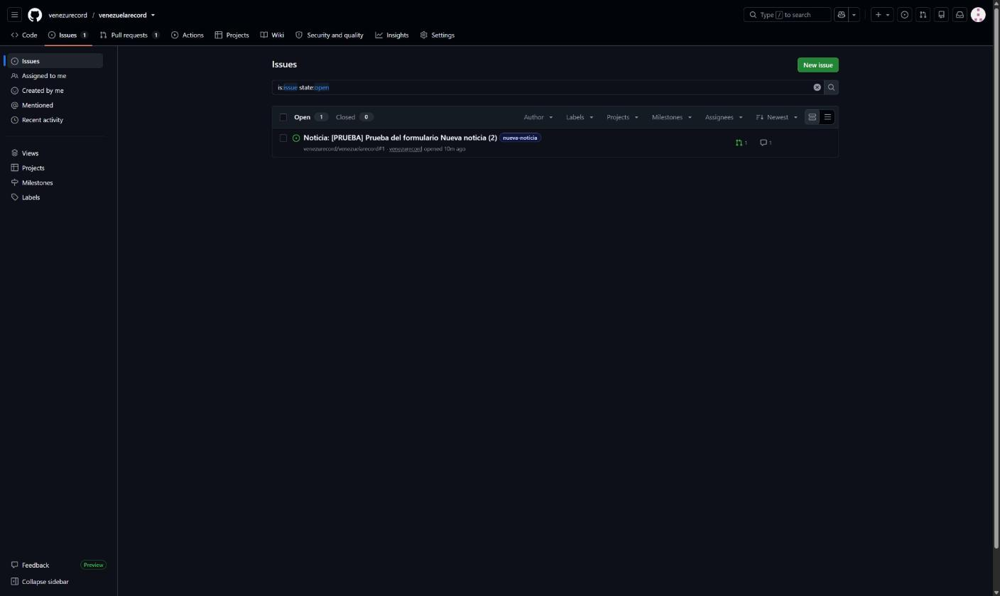
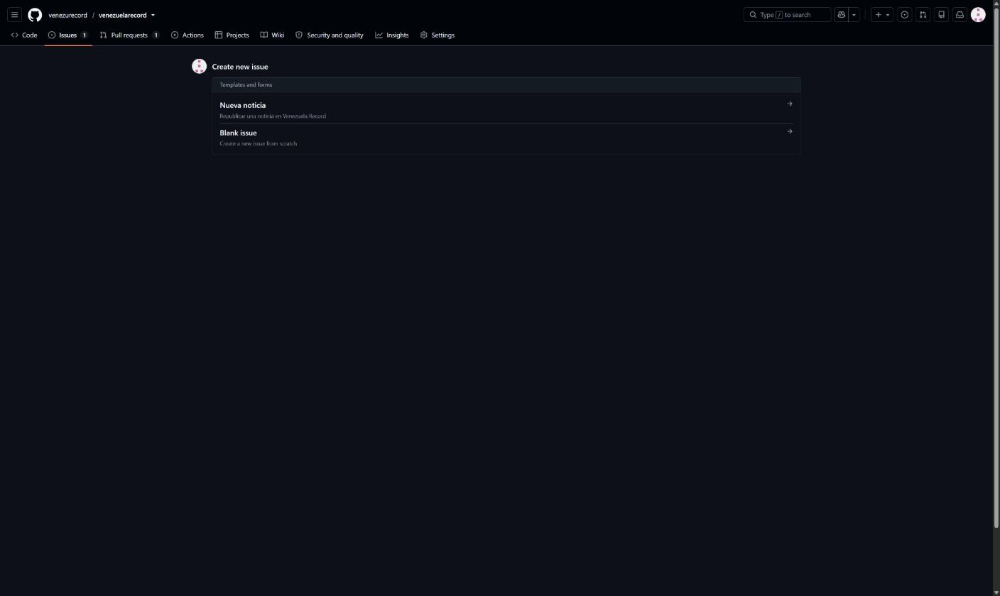
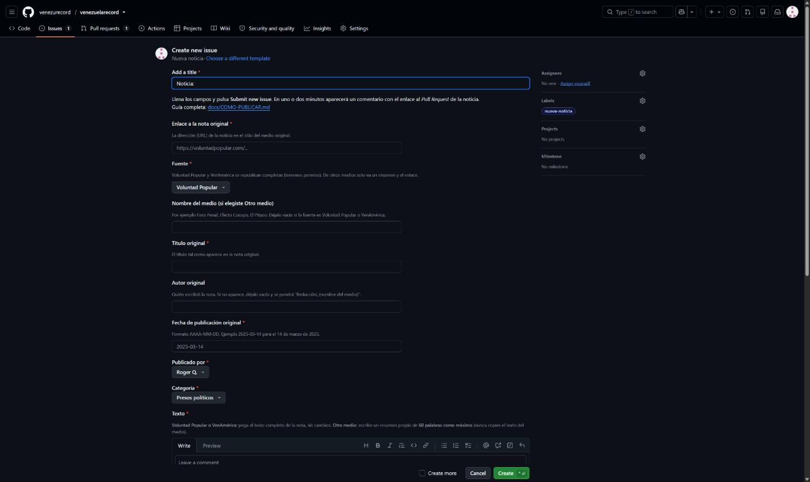
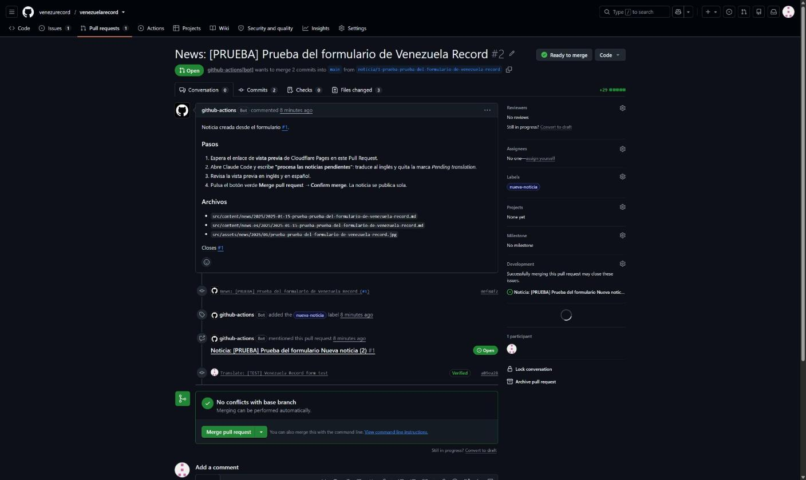

# Cómo publicar una noticia en Venezuela Record

Guía para **Roger** y **Eyleen**. Todo se hace desde la página de GitHub, sin terminal.
Funciona igual en la computadora y en el teléfono: en el teléfono usa el navegador (Chrome o Safari) y entra en
**github.com** con tu cuenta.

**Resumen:** llenas un formulario → GitHub prepara la noticia sola → le pides a Claude la traducción →
revisas la vista previa → pulsas **Merge**. La noticia aparece en el sitio en inglés y en español.

---

## Antes de empezar: ¿se puede publicar?

- ✅ **Sí:** política venezolana, represión y presos políticos, derechos humanos, elecciones y poder,
  decisiones internacionales que afectan políticamente a Venezuela, situación del país (economía, servicios,
  crisis humanitaria) en su dimensión política.
- ❌ **No:** farándula, deportes, noticias de migración, vida de venezolanos en EE. UU., opinión sin un hecho
  noticioso.
- **Voluntad Popular y VenAmérica** → se pega el **texto completo** y se pone **su foto** (si la nota no
  tiene foto, se deja vacío y sale una tarjeta con el nombre del medio).
- **Cualquier otro medio** → solo un **resumen tuyo de 60 palabras como máximo**. **Nunca** su texto completo ni
  su foto (salvo fotos con licencia libre, por ejemplo CC BY).

---

## Paso 1 — Abrir el formulario "Nueva noticia"

1. Entra en <https://github.com/venezurecord/venezuelarecord>.
2. Arriba, haz clic en la pestaña **Issues**.
3. Haz clic en el botón verde **New issue** (arriba a la derecha).

   

4. Elige **Nueva noticia**.

   

> Atajo: guarda en favoritos este enlace, que abre el formulario directamente:
> <https://github.com/venezurecord/venezuelarecord/issues/new?template=nueva-noticia.yml>

## Paso 2 — Llenar el formulario

1. **Add a title:** deja la palabra "Noticia:" y añade el título, por ejemplo `Noticia: Liberan a…`
   (solo sirve para reconocerla en la lista).
2. **Enlace a la nota original:** copia y pega la dirección de la noticia en el sitio del medio.
3. **Fuente:** elige Voluntad Popular, VenAmérica u **Otro medio**.
4. **Nombre del medio:** solo si elegiste *Otro medio* (por ejemplo `Foro Penal`).
5. **Título original:** el título tal cual aparece en la nota.
6. **Autor original:** quién la escribió. Si no aparece, déjalo vacío.
7. **Fecha de publicación original:** en formato **AAAA-MM-DD**. Ejemplo: el 14 de marzo de 2025 se escribe
   `2025-03-14`. ⚠️ Es la fecha **de la nota original**, no la de hoy: con ella se ordena todo el sitio.
8. **Publicado por:** tu nombre (Roger Q. o Eyleen V.).
9. **Categoría:** la que mejor encaje.
10. **Texto:**
    - Voluntad Popular / VenAmérica: copia **todo** el texto de la nota y pégalo, sin cambiar nada.
    - Otro medio: escribe **con tus palabras** un resumen de 60 palabras como máximo.
11. **Imagen:** arrastra la foto de la nota original dentro del recuadro (en el teléfono: toca el recuadro y
    luego *Paste, drop, or click to add files* para elegir la foto). Espera a que aparezca un texto que empieza
    por ` La primera vez que publiques, recarga la página (tecla F5 o desliza hacia abajo en el teléfono) si el
> comentario no aparece después de 2 minutos.

## Paso 4 — Pedir la traducción a Claude

Abre Claude Code en la carpeta del proyecto y escribe:

> **procesa las noticias pendientes**

Claude traduce al inglés el título, el resumen y el texto (la versión en español queda con el texto original),
revisa que todo cumpla las reglas y sube el cambio al mismo *Pull Request*.

## Paso 5 — Revisar la vista previa

En el *Pull Request* aparece un comentario de **Cloudflare Pages** con un enlace de vista previa
(*Preview URL*). Ábrelo y revisa la noticia en inglés y en español (botón **Español / English** arriba a la
derecha). Mientras falta la traducción, la noticia muestra la etiqueta amarilla **Pending translation**.

## Paso 6 — Publicar

1. En el *Pull Request*, baja hasta el botón verde **Merge pull request** y púlsalo.
2. Pulsa **Confirm merge**.
3. Listo. En uno o dos minutos la noticia está publicada en el sitio, en los dos idiomas, y el formulario se
   cierra solo.

> Si decides **no** publicarla: en el *Pull Request* pulsa **Close pull request**. No se publica nada.

---

## Preguntas frecuentes

**¿Puedo publicar desde el teléfono?** Sí. Todos los pasos funcionan en el navegador del teléfono. La
traducción (paso 4) la hace Claude desde la computadora.

**Me equivoqué en un dato después de publicar.** Escríbele a Claude qué noticia es y qué hay que corregir.

**¿Quién puede usar el formulario?** Solo las cuentas con permiso de escritura en el repositorio. Si otra
persona lo llena, queda como sugerencia y no se crea nada.

**¿Dónde veo todas las noticias pendientes?** En la pestaña **Pull requests** del repositorio.
